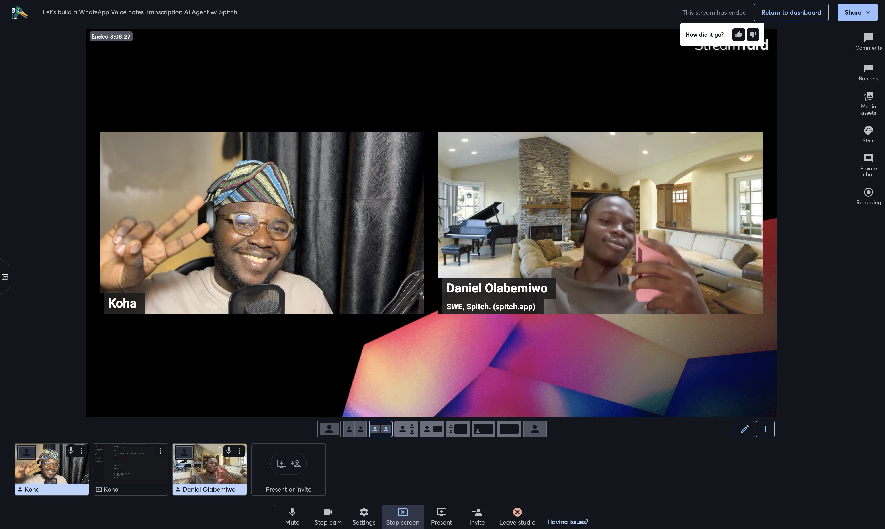
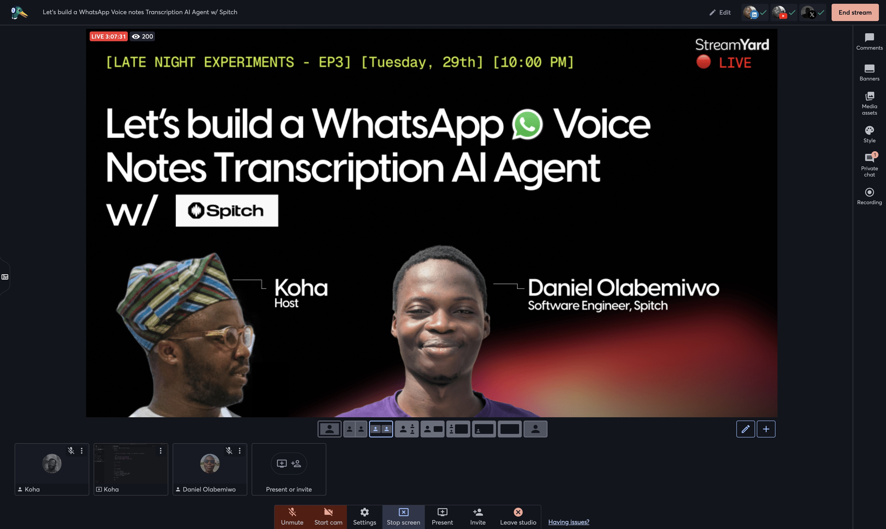
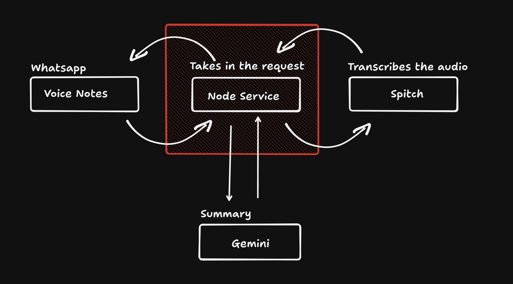

# Ditto

A WhatsApp bot that transcribes audio messages and summarizes them using [Spitch](https://spitch.app) and [Gemini](https://gemini.google.com).

Built with [Daniel Olabemiwo](https://x.com/danielolabemiwo) (SWE, Spitch) during Late Night Expermient EP3

Watch on YouTube: https://www.youtube.com/live/mrPXLi5fFks?si=jrY9uKML4U9qwGtt
Watch on X: https://x.com/kohawithstuff/status/1917323833687556511

## Live session



## Flow


## Features

- [x] Transcribe audio messages
- [x] Summarize transcribed text using Gemini
- [x] Send the transcription and summary to the user

## Usage

1. Clone the repository

```bash
git clone https://github.com/yourusername/ditto-spitch.git
```

2. Install dependencies

```bash
pnpm install
```

3. Clone the `.env.example` file into `.env` and add your credentials

```bash
SPITCH_API_KEY=your_spitch_api_key
GEMINI_API_KEY=your_gemini_api_key
GEMINI_MODEL=models/gemini-1.5-pro-latest
```

4. Run the bot

```bash
pnpm run start
```

## Contributing

1. Fork the repository
2. Create a new branch
3. Make your changes and commit them
4. Push your changes to your fork
5. Create a pull request

## License

MIT
